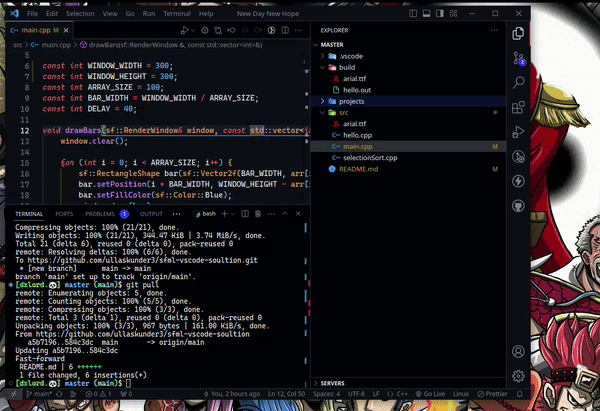

# VSCode SFML C++ Project Setup

This is a simple SFML C++ project running with vs code that can be built and run on both Linux and Windows using Visual Studio Code.



## Prerequisites

- Visual Studio Code: [Download and install Visual Studio Code](https://code.visualstudio.com/download)
- SFML Library:
  - Linux: Install SFML using your package manager. Example for Debian-based systems:
    ```
    sudo apt-get install libsfml-dev
    ```
    or (depends on which linux)

    ```
    sudo dnf -y install SFML
    ```
    - might need few tweaking
  - Windows: Download and install SFML from [the official SFML website](https://www.sfml-dev.org/download.php)
    - GCC 13.1.0 MinGW (DW2) - `32-bit`
   or
    - GCC 13.1.0 MinGW (SEH) - `64-bit`
    
    > dont messup check (64 or 32) bit properly

  - Extract the downloaded file and place it where ever you want remember the path

## Setting up MinGW on Windows

1. Install MinGW w64 (for Windows) using [mingw-w64.org](https://www.mingw-w64.org/downloads/#mingw-builds).
   - **Tarballs** for the mingw-w64 sources are hosted on SourceForge.
   - https://sourceforge.net/projects/mingw-w64/files/mingw-w64/mingw-w64-release/

3. Add the MinGW w64 bin directory to your system's PATH variable.
   - Example PATH addition: `C:\mingw-w64\mingw64\bin` (adjust the path based on your installation).
   - want's to know the difference between [ming's 😄 link to repo](https://github.com/ullaskunder3/cpp-setup-vsCode#setup)

## Setting up C++ on linux

  - Linux: Ensure you have GCC (GNU Compiler Collection) installed. Run the following commands to check the version and path:
    ```
    g++ --version
    which g++
    ```

    ```bash
    [dxlord.🐼] master (main)$ g++ --version

    g++ (GCC) 13.2.1 20231205 (Red Hat 13.2.1-6)
    Copyright (C) 2023 Free Software Foundation, Inc.
    This is free software; see the source for copying conditions.  There is NO
    warranty; not even for MERCHANTABILITY or FITNESS FOR A PARTICULAR PURPOSE.

    [dxlord.🐼] master (main)$ which g++
    
    /usr/bin/g++
     
    ```

>see it's too much that's why I use linux

## Getting Started

1. Clone the repository:

```
git clone https://github.com/ullaskunder3/sfml-vscode-soultion.git
cd <sfml-vscode-soultion>
```


2. Open the project in Visual Studio Code.

3. Install the required extensions: C/C++

4. Configure IntelliSense:
- Open `.vscode/c_cpp_properties.json` and update the paths for Windows/Linux users.
- After checking path properly update it 

## Building and Running

Pressing `Ctrl+Shift+B` or running **Tasks: Run Task** from the global Terminal menu show the following picker pick **Run C++ program with SFML**

watch the program execute and run at the same time automatically

|||
|--|--|

||
|--|

## Troubleshooting

- If you encounter any issues, ensure that you have the required dependencies installed and that the paths in `.vscode/c_cpp_properties.json` are correct.

- For Windows users, make sure to update the paths in `.vscode/c_cpp_properties.json` with the correct MinGW or Visual Studio installation paths.

- let me know if still need help

## Contributing

Feel free to contribute to this project by opening issues or pull requests.

Happy coding!
